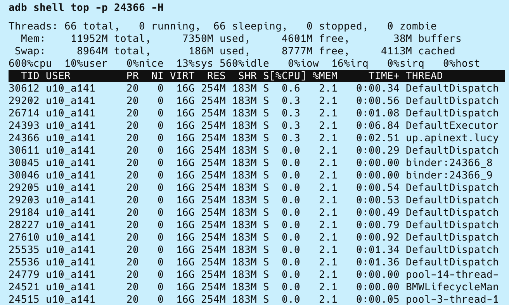
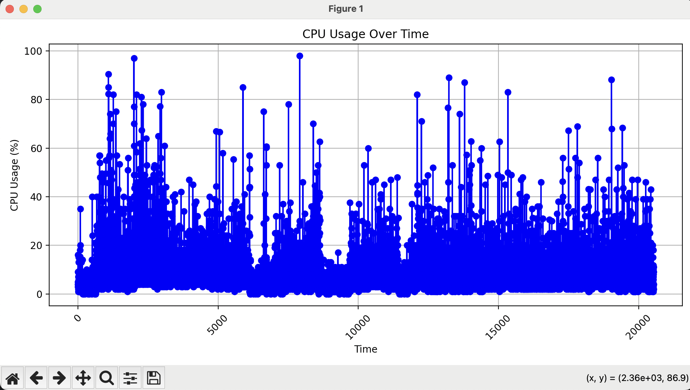

# Background
Android apps always face the challenge of CPU and memory threshold; therefore, the library aims to detect, analyze, and optimize performance.

# Detect tools
## adb shell top and python script
1: check the process name of apps, for example, com.jack.performance
```bash
adb shell ps | grep com.jack.performance
```
2: get the consumption of CPU and memory
```bash
adb shell top -p {pid} -H
```



3: Using python script to capture datas, the data will be saved in the Desktop file
```bash
source ./venv/bin/activate
python getTop.py com.jack.performance
```

4: generate the chart figure

```bash 
source ./venv/bin/activate
python3 cpu-chart.py xxx.txt
```



## [Perfetto](https://ui.perfetto.dev/#!/record/cmdline)

### Option 1: Capture data by command line 
1: setup probes(injection), then save the config.gpx


2: Copy and save the config.gpx


**real file -> /configure/cpu-config.gpx**

3: execute command

```bash
cat config.pbtx | adb shell perfetto -c - --txt -o /data/misc/perfetto-traces/trace.pftrace
```

4: pull the trace file

```bash
adb pull /data/misc/perfetto-traces/trace.pftrace
```

## Systrace

## profile (Android Studio) 


# Analyze 


# Optimization approaches

