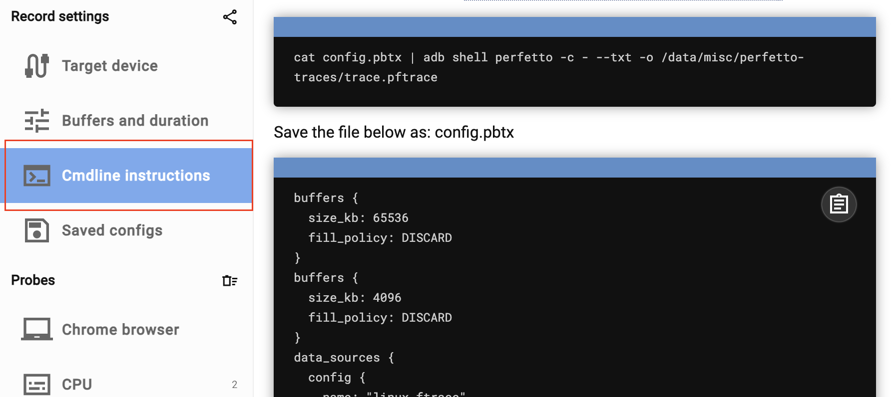

# Background
Android apps always face the challenge of CPU and memory threshold; therefore, the library aims to detect, analyze, and optimize performance.

# Detect
## [Perfetto](https://ui.perfetto.dev/#!/record/cmdline)

### Option 1: Capture data by command line 
1: setup probes(injection), then save the config.gpx


2: Copy and save the config.gpx



**real file -> /configure/cpu-config.gpx**

3: execute command

```bash
cat config.pbtx | adb shell perfetto -c - --txt -o /data/misc/perfetto-traces/trace.pftrace
```

4: pull the trace file

```bash
adb pull /data/misc/perfetto-traces/trace.pftrace
```

## Systrace

## profile (Android Studio) 


# Analyze 


# Optimization approaches

