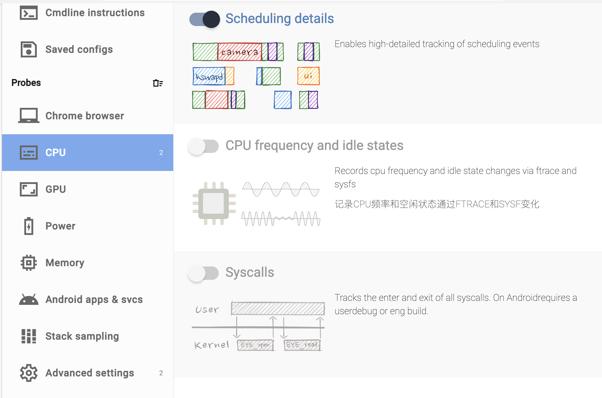

# Background
Android apps always face the challenge of CPU and memory threshold; therefore, the library aims to detect, analyze, and optimize performance.

# Detect
## [Perfetto](https://ui.perfetto.dev/#!/record/cmdline)
Usage details(personal experience)
### Option1: Capture data by command line 
1: setup probes(injection), then save the config.gpx

## Systrace

## profile (Android Studio) 

# Analyze 

# Optimization approaches

